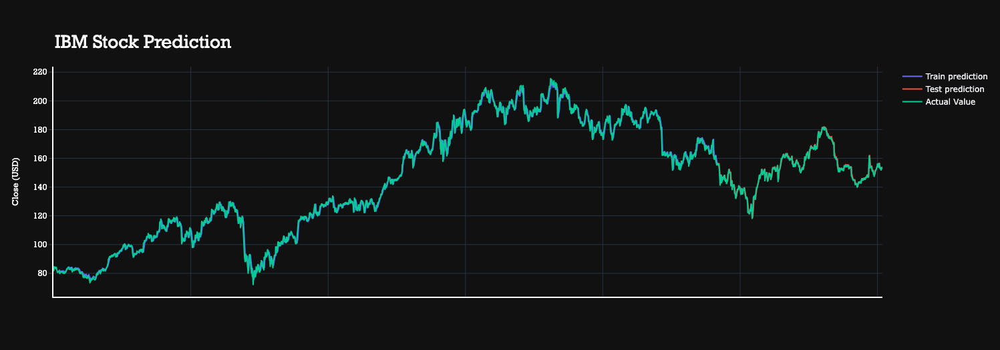

# Stock Market Analysis

Welcome to Stock Market Analysis Project! This project focuses on analyzing and forecasting the stock prices of four major companies: Amazon, Google, Microsoft, and IBM. It's an exploration of historical financial data, predictive modeling, and data-driven decision support.

## Table of Contents
- [Introduction](#introduction)
- [Key Features](#key-features)
- [Project Overview](#project-overview)
- [Technologies Used](#technologies-used)
- [How to Use](#how-to-use)
- [Results and Insights](#results-and-insights)
- [Interactive Visualizations](#interactive-visualizations)
- [Conclusion](#conclusion)

## Introduction

In today's fast-paced financial world, making informed investment decisions is crucial. This project aims to help you gain insights into the stock performance of leading technology companies and make data-driven financial decisions.

## Key Features

- Data collection and preprocessing for Amazon, Google, Microsoft, and IBM stock prices.
- Exploratory Data Analysis (EDA) to understand historical stock performance and correlations.
- Time series analysis, including moving averages and ARIMA modeling.
- Machine learning models (LSTM and GRU) for stock price prediction.
- Performance evaluation and risk assessment.
- Interactive visualizations to explore historical data and predictions.

## Project Overview

The project is divided into several phases, including data collection, analysis, modeling, and visualization. It leverages various techniques, such as time series analysis and machine learning, to provide insights into stock price movements.

## Technologies Used

- Python
- Pandas
- NumPy
- Matplotlib
- Seaborn
- Plotly
- PyTorch
- Scikit-Learn

## How to Use

1. Clone the repository to your local machine.
2. Install the required Python packages by running: `pip install -r requirements.txt`.
3. Or you can upload the datasets and the jupyter notebook to Google Collab for the execution.
4. Run the Jupyter notebooks to explore the data, conduct analysis, and build models.

## Results and Insights

The project gives insights into the historical stock performance of Amazon, Google, Microsoft, and IBM. It includes predictions that can assist with investment decisions. Please refer to the project's Jupyter notebook and results for more details.

## Interactive Visualizations

Interactive visualizations are available to explore stock prices, trends, and predictions. Above image is one of those interactive visualizations. These visualizations make it easy to understand the data and gain insights.

## Conclusion

This Stock Market Analysis Project serves as a valuable resource for understanding financial data analysis, time series modeling, and the application of machine learning in finance. While it provides tools for decision-making, remember that the stock market carries inherent risks, and past performance is not always indicative of future results.

For more details and to interact with the project, please visit the Jupyter notebooks and explore the interactive visualizations.

